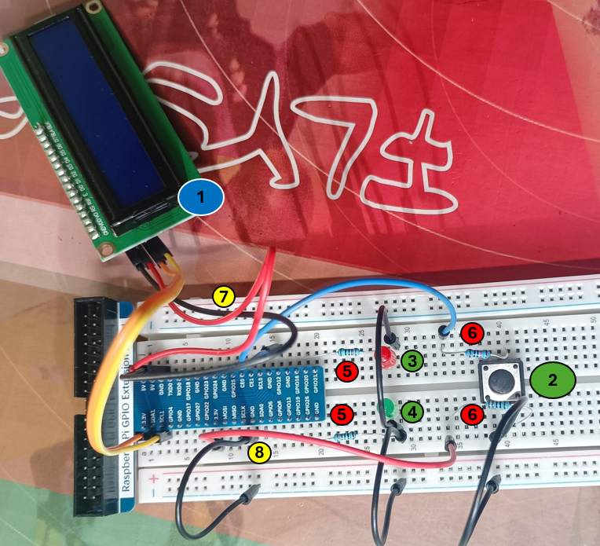
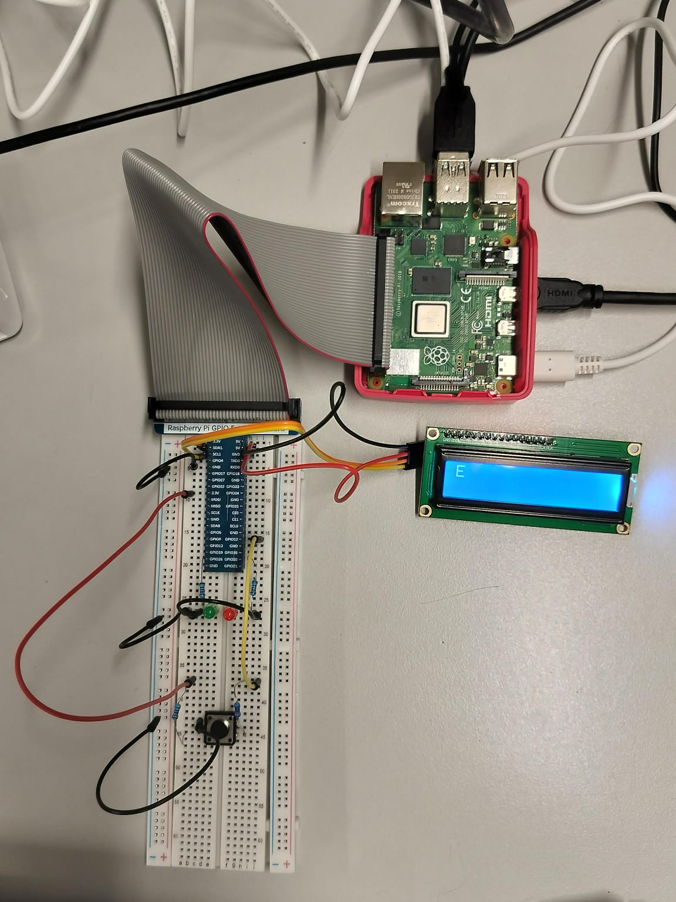

# Proyecto ADE: Traductor Morse
<p align="center"></p>

## Tabla de contenidos:
---
- [Introducción](#introducción)
- [Configuración software](#configuración-software)
- [Configuración hardware](#configuración-hardware)
- [Modo de uso](#modo-de-uso)
  
## Introducción

Este repositorio contiene el código fuente para la implementación de un traductor de código Morse en una Raspberry Pi. El proyecto se encuentra diseñado para escribir caracteres en Morse mediante un botón y/o la terminal del celular e imprimir en una pantalla LCD la traducción en alfabeto latino. Además, las dos luces LED incluidas en el proyecto permiten al usuario monitorizar el estado de la traducción/envio de caracteres, proporcionando una interfaz simple e intuitiva para dar los primeros pasos en el aprendizaje del código Morse.

Clona el repositorio:
```
git clone https://github.com/perezADEolazar/Proyecto-ADE-Traductor-Morse
```

A continuación, se encuentran descritos los requisitos y el proceso a seguir para configurar el proyecto.

## Configuración software

Los archivos necesarios para configurar el proyecto se encuentran divididos en tres grupos: configuración de periféricos, función de traducción y arranque automático. 

### Configuración de periféricos 💡

Algunos dispositivos externos utilizados en este proyecto requieren la configuración mediante software de varios puertos de la Raspberry Pi. Concretamente, las dos luces LED y el botón se comunican mediante los puertos GPIO y la pantalla LCD utiliza el protocolo i2C con los canales SDA y SCL. Además, el envio de los mensajes traducidos al celular se realiza mediante protocolo UDP. 

*El control de los puertos GPIO se realiza en código C mediante las librerias **pigpio**, **stdlib** y **stdio** y requiere la compilación para su ejecución:*

```
//Importar librerias y archivos
#include <stdio.h>
#include <stdlib.h>
#include <pigpio.h>

//Definir pines GPIO a utilizar
#define GreenledPin 26
#define RedledPin 20
#define ButtonPin 12
```

Comando de compilación en Linux, el cual crea el archivo .so (*Shared Object*) para poder ser utilizado en los archivos de Python:
```
gcc -Wall -shared -o control_gpio.so -fPIC control_gpio.c -lpigpio
```

*La comunicación con la pantalla se realiza en código Python utilizando la libreria **smbus** y define una dirección de memoria para el dispositivo:*

```
#Importar librerías y archivos
import smbus
from time import sleep

#Configuración del bus para la pantalla LCD
I2CBUS = 1
ADDRESS = 0x27
```

*La comunicación con el celular se realiza en código Python utilizando la libreria **socket** para configurar el UDP y require la conexión del dispositivo a la red IP de la Raspberry Pi:*

```
#Importar librerías y archivos
import socket

#Configuración del servidor
HOST = '0.0.0.0'
PORT = 5002  # Puerto arbitrario
```

### Función de traducción 📚

El archivo principal del proyecto consta de varias funciones que traducen el mensaje, encienden las luces de envío e imprimen la información final en la pantalla. Además, el bucle principal muestrea en intervalos concretos de tiempo el estado del botón/terminal del celular para seleccionar cuál de los caracteres pretende escribir el usuario y distinguir entre el envío de cada letra y la palabra entera.

El código se encuentra en lenguaje Python e incluye los archivos de configuración de periféricos:

```
#Importar librerías y archivos
import ctypes
import time
import I2C_LCD_driver

#Cargar archivo de configuración GPIO
lib = ctypes.CDLL('/home/ADE-MASTER/Desktop/morse/proyecto/control_gpio.so')
```

```
button_press_time0 = time.time() #Hora de la primera pulsación guardada para escribir letras
button_press_time1 = time.time() #Hora de la primera pulsación guardada para enviar la palabra
```

```
if (time.time()-button_press_time0>1.5): #1.5 segundos sin pulsar significa guardar letra
```

```
if (time.time()-button_press_time1>6): #6 segundos sin pulsar significa guardar y traducir palabra
```

### Arranque automático 🔌

Los archivos **boot** incluidos en el repositorio tienen como objetivo configurar la ejecución automática del proyecto en cada arranque de la Raspberry Pi. Para ello, es necesario generar un *servicio* con el archivo boot.service, el cual ejecuta un código Python del mismo nombre. Este archivo importa todos los programas de configuración y traducción mencionados anteriormente y lanza un mensaje de inicialización en la pantalla y las luces LED. 

```
#Importar librerías y archivos
import I2C_LCD_driver
import udp_socket
import ctypes
import time
import funcionalidad_morse

#Cargar archivo de configuración GPIO
lib = ctypes.CDLL('/home/ADE-MASTER/Desktop/morse/proyecto/control_gpio.so')
```

Comandos en Linux:
```
sudo cp udp-server.service /etc/systemd/system/
systemctl enable udp-server
sudo reboot
```

## Configuración hardware
En cuanto montaje físico del proyecto, se necesitan ciertos componentes que conforman el siguiente circuito eléctrico:
<p align="center">
  
</p>

### Componentes
Estos son los componentes que se han utilizado, acorde a la enumeración de la imagen:
1. **Pantalla LCD** 16x2 con módulo **i2C**
2. **Push Button Switch**
3. **LED rojo**
4. **LED verde**
5. **Resistencias 200Ω** (x2) para los LED
6. **Resistencias 10kΩ** (x2) para el botón
7. **Cables Jumper M-F** (x4) para la conexión de la pantalla
8. **Cables Jumper M-M** (los necesarios) para la configuración de los LEDs y el botón

La pantalla es conectada mediante el protocolo i2C, en los pines SDA, SCL, GND y 5V existentes entre los puertos GPIO.
El botón se conecta al puerto GPIO12 y tanto a la alimentación de 3.3V como a GND. El LED rojo se conecta en la manera ilustrada en naranja, con el ánodo hacia la extensión GPIO de la Raspberry Pi, al pin GPIO20; y el cátodo a GND. Con la misma configuración, el LED verde se conecta al pin GPIO26.

## Modo de uso
**Todo código se encuentra documentado para una mejor interpretación de la funcionalidad**

El proyecto se ejecuta junto a la inicialización de la Raspberry Pi. El usuario podrá ver en la pantalla LCD un mensaje que indica:
```
BOTON / CELULAR
```
Si el usuario quiere escribir mediante el celular y ver el texto traducido en la pantalla, simplemente debe esperar el tiempo necesario (cinco segundos) hasta que en la pantalla aparezca 
```
CELULAR
```
En cambio, si se quiere escribir mediante el montaje del botón, debe pulsar el mismo antes de ese tiempo, y verá 
```
BOTON
``` 
en la pantalla.

A continuación, los LEDs comenzarán a parpadear para avisar que la funcionalidad está en marcha, junto con el siguiente mensaje en pantalla:
```
Escribe Morse!
``` 
Según se apaguen los LEDs, el usuario procederá a escribir Morse en la manera elegida.

### Morse con Botón
La funcionalidad consiste en pulsar el botón cada vez que se quiera escribir un **punto (.)** y ver el punto reflejado en la pantalla, o, en su defecto, mantener pulsado el botón aproximadamente un segundo hasta que en la pantalla aparezca una **raya (-)**. Así, se pueden combinar tantos puntos y rayas como se deseen.

Si se considera que la letra a escribir, es decir, el conjunto de puntos y rayas se ha terminado, hay que esperar 1.5 segundos a que el LED verde se encienda, y se verá ese conjunto de caracteres escritos en la pantalla para corroborar lo escrito.

Si el usuario desea escribir otra letra, según se apague el LED verde, podrá proceder a pulsar el botón cuanto desee, volviendo al primer paso.

Al contrario, si cree conveniente terminar de escribir y/o traducir la palabra escrita, solo se tiene que esperar unos seis segundos hasta que el LED rojo comience a parpadear.

En ese estado, mientras el LED parpadea aún más rápido, al mantener pulsado el botón se puede cancelar la traducción del mensaje, y proceder a escribir otra vez. 
Si no se pulsa el botón, el LED se quedará encendido y aparecerán las letras traducidas en la pantalla.

### Morse con Celular
Para enviar un código Morse desde el servidor UDP del dispositivo celular, se deben enviar el **conjunto de caracteres separados por espacios**, como por ejemplo:
```
-.- . .-. -- .- -.
```
Se envía ese conjunto para obtener lo siguiente en pantalla: 
```
KERMAN
```

La siguiente imagen refleja el resultado tras recibir un caracter en Morse:
<p align="center">
  
</p>
